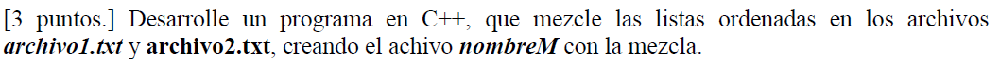
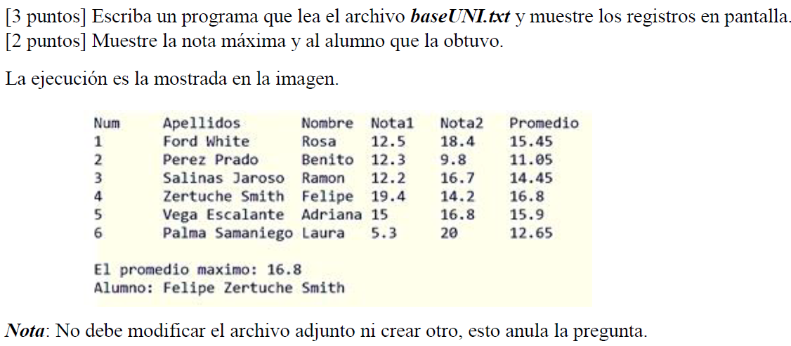

# Laboratorio 7: Archivos - Introducción a la Programación Orientada a Objetos

## Ejercicio 1



## Ejercicio 2



## Ejercicio  3

Una empresa de distribución ha generado un archivo binario llamado: `ventas.dat`

El archivo contiene información de ventas realizadas durante un mes y tiene la siguiente estructura

```cpp
struct Venta {
    int idVenta;
    int idVendedor;
    int idProducto;
    int cantidad;
    double precioUnitario;
};
```

y contiene:

```txt
[int totalRegistros]
[Venta 1]
[Venta 2]
...
[Venta N]
```

Es decir, primero un entero con la cantidad total de registros, luego los registros binarios consecutivos.

A partir de esa información:


* Leer el archivo binario.
* Calcular el monto total vendido

    $monto = \sum (cantidad \times precioUnitario)$

* Determinar el vendedor con mayor recaudación

    Para cada vendedor:

    $totalVendedor=\sum(cantidad×precioUnitario)$

    Mostrar:
    * ID del vendedor
    * Total vendido

* Determinar el producto más vendido (por cantidad), sumando todas las cantidades por producto.

    Mostrar:
    * ID del producto
    * Total unidades vendidas

* Detectar ventas sospechosas

    * Una venta es sospechosa si: cantidad > 100
    * Listar todas esas ventas.

* Generar el archivo `reporte.txt`

    Ejemplo de Salida:

```txt
--- REPORTE GENERAL DE VENTAS ----

Total de registros: 150

MONTO TOTAL VENDIDO:
S/. 845230.75

---------------------------------------
VENDEDOR CON MAYOR RECAUDACIÓN:
ID Vendedor: 7
Total vendido: S/. 145000.20

---------------------------------------
PRODUCTO MÁS VENDIDO:
ID Producto: 12
Total unidades: 985

---------------------------------------
VENTAS SOSPECHOSAS (cantidad > 100):

ID Venta: 45 | Vendedor: 3 | Producto: 8 | Cantidad: 150
ID Venta: 78 | Vendedor: 5 | Producto: 12 | Cantidad: 200

```

# Ejercicio 4

### Parte 1
Se desea implementar un sistema simple para manejar cuentas bancarias. Cada cuenta tiene:

* Número de cuenta
* Nombre del titular
* Saldo

El sistema debe permitir:

* Crear cuenta
* Depositar dinero
* Retirar dinero
* Mostrar información de cuenta
 

A continuación se muestra una posible implementación. 
```cpp
#include <iostream>
#include <string>
using namespace std;

struct Cuenta {
    int numero;
    string titular;
    double saldo;
};

// Variable global
Cuenta cuentaGlobal;

// Crear cuenta
void crearCuenta(int num, string nombre, double saldoInicial) {
    cuentaGlobal.numero = num;
    cuentaGlobal.titular = nombre;
    cuentaGlobal.saldo = saldoInicial;
}

// Depositar
void depositar(double monto) {
    cuentaGlobal.saldo += monto;
}

// Retirar
void retirar(double monto) {
    cuentaGlobal.saldo -= monto;
}

// Mostrar información
void mostrarCuenta() {
    cout << "Cuenta: " << cuentaGlobal.numero << endl;
    cout << "Titular: " << cuentaGlobal.titular << endl;
    cout << "Saldo: " << cuentaGlobal.saldo << endl;
}

int main() {
    crearCuenta(123, "Carlos", 1000);
    retirar(1500);   // ¿Qué pasa aquí?
    mostrarCuenta();
}
```

Analice cuidadosamente el código y responda a las siguientes preguntas

1.  ¿Dónde puede romperse el programa? Analice, el orden de ejecución, posibles errores lógicos, usos indebidos


2. ¿Quién garantiza que el saldo no sea negativo? ¿Existe alguna validación?

3. ¿Qué pasa si olvidamos llamar a crearCuenta() antes de usar depositar()?

4. ¿Puede cualquier parte del programa modificar el saldo directamente?
    Por ejemplo: cuentaGlobal.saldo = -999999;

5. ¿Qué sucede si tuviéramos 100 cuentas?

Implemente una versión mejorada agregando

* Validación de saldo negativo
* Validación de monto > 0
* Manejo de múltiples cuentas
* Archivo binario
* Acceso aleatorio por número de cuenta


### Parte 2
Diseñar e implementar un sistema de gestión de cuentas bancarias aplicando correctamente los principios de la Programación Orientada a Objetos (POO), garantizando:

* Encapsulamiento
* Protección del estado
* Validación centralizada
* Persistencia en archivo binario
* Acceso aleatorio a registros

Recordar que el sistema bancario debe permitir:
* Crear una cuenta bancaria.
* Depositar dinero en una cuenta.
* Retirar dinero de una cuenta.
* Mostrar la información de una cuenta.
* Persistir la información en un archivo binario.
* Acceder a las cuentas mediante acceso aleatorio (usando seekg y seekp).

Considerando la discusión anterior, tenga en cuenta que.

* El saldo NO puede ser modificado directamente desde fuera de la clase.
* La validación de montos debe estar dentro de la clase.
* Una cuenta nunca puede quedar con saldo negativo.
* El objeto debe garantizar estado válido desde el constructor.
* No se permiten variables globales.
* Implementar un menú debe  interactivo.


* Los datos deben almacenarse en un archivo binario llamado cuentas.dat.
* Las cuentas deben guardarse usando escritura binaria directa.
* El sistema debe permitir modificar registros usando acceso aleatorio.


Una vez implementado el sistema base correctamente, deberá agregar las siguientes funcionalidades:

#### 1. Transferencia entre cuentas

* Permitir transferir dinero desde una cuenta origen hacia una cuenta destino.
* No se permite transferir a la misma cuenta.
* La transferencia debe fallar si:
    * La cuenta origen no tiene fondos suficientes.
    * Alguna cuenta no existe.
    * El monto es inválido.

La transferencia debe reutilizar la lógica de validación ya implementada en la clase Cuenta.
No se permite duplicar validaciones fuera del objeto.

#### 2. Aplicar interés mensual

El sistema debe permitir aplicar una tasa de interés a todas las cuentas registradas.

* El usuario ingresa una tasa (por ejemplo 0.02 para 2%).
* El sistema debe recorrer el archivo completo.
* Cada cuenta debe actualizar su saldo aplicando el interés.

La lógica del cálculo debe estar dentro de la clase Cuenta.

#### 3. Bloqueo automático por saldo mínimo

Se debe modificar el sistema para que:

* Si una cuenta cae por debajo de un saldo mínimo definido (por ejemplo 100 unidades monetarias), la cuenta se bloquee automáticamente. Una cuenta bloqueada:

* No puede retirar dinero.
* Sí puede recibir depósitos.
* El estado de bloqueo debe ser parte del objeto.

Debe mostrarse el estado (ACTIVA o BLOQUEADA) al imprimir la cuenta.


<!--


<span style="color:red;"> ERROR CRÍTICO</span>

<span style="color:green;"> Estado válido</span>

<span style="color:#1E90FF;">Encapsulamiento</span>


<span style="background-color:yellow;">Estado inválido</span>

<span style="background-color:#ffe6e6; padding:4px; border-radius:6px;">
Saldo negativo detectado
</span>

<span style="font-size:20px;">Diseño antes que código</span>

<span style="color:#b30000; font-weight:bold; font-size:18px;">
El estado debe estar protegido
</span>


<div style="border-left:5px solid red; padding:10px; background:#ffe6e6;">
<strong>Error de diseño:</strong> El saldo puede volverse negativo.
</div>

-->
